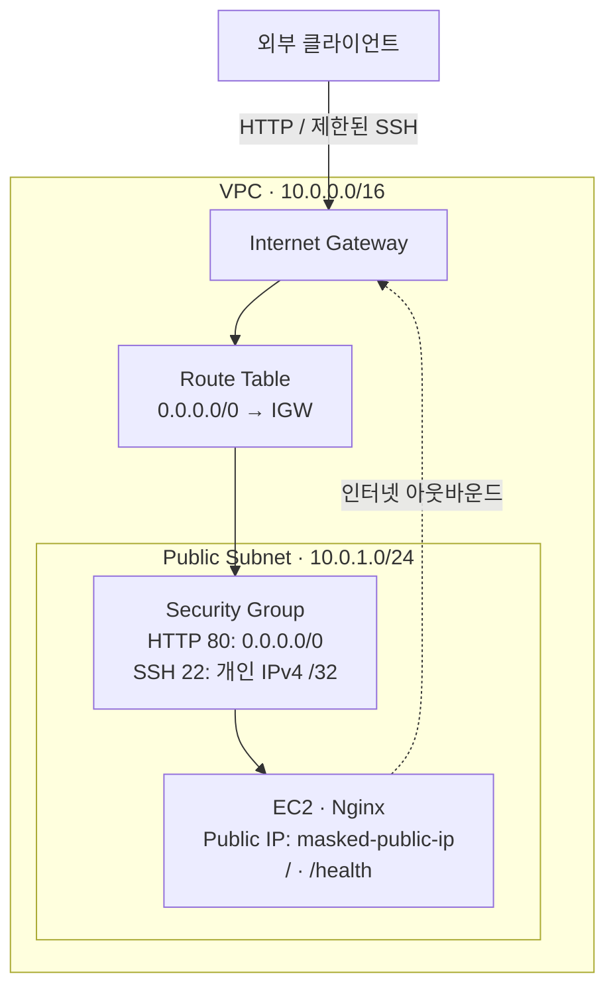

## 구성

| 항목 | 설정 |
| --- | --- |
| 리전 / EC2 | `ap-northeast-2` / `t3.micro` |
| AMI | Canonical Ubuntu 24.04 LTS `x86_64`, 소유자·아키텍처 확인 |
| EBS | 암호화된 `gp3` 8 GiB, 인스턴스 종료 시 삭제 |
| 인스턴스 | 자동 public IPv4, IMDSv2 필수, CPU credit `standard` |
| 아웃바운드 | 전체 IPv4 허용 |

접속 IP와 리소스 ID는 마스킹했다. 네트워크 CIDR은 구성값이다.
